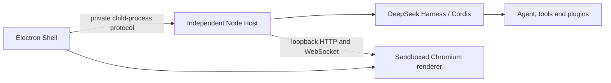

# DeepSeek Harness Station

[简体中文](README.zh-CN.md)

DeepSeek Harness Station is an experimental desktop workstation for DeepSeek Harness. It combines a narrow Electron shell with an independently supervised Node.js Host. The Host owns the Cordis tree, Agent runtime, sessions, tools, terminals, profiles, and third-party plugins; the Electron process owns only native application lifecycle and presentation.

This repository is a clean-room implementation. It uses the published DeepSeek Harness APIs and documentation and does not contain source copied from other desktop wrappers.

## Architecture



The Shell generates a new generation id and capability for every Host launch. The Host publishes readiness only after the complete Harness Web profile activates and the operating system assigns its loopback port. The Shell rejects stale generations and non-loopback origins. A graceful stop disposes the Cordis root before the supervisor escalates to process termination.

## Development

Requirements: Node.js `^22.19.0 || >=24.0.0`, Corepack, and pnpm 11.7.0.

```sh
corepack pnpm install
corepack pnpm check
corepack pnpm dev
```

The default Host loads the standard `web` profile from the published `@deepseek-ai/dsh` installation. Harness credentials and user configuration retain their normal `$DSH_HOME` behavior.

## Current scope

The first milestone provides the process split, Web profile boot, guarded navigation, single-instance behavior, bounded startup, and graceful Host disposal. Packaging, profile selection UI, updater integration, tray controls, crash-loop recovery, and authenticated browser bootstrap remain subsequent milestones.

## Project status

This is pre-release software. The lifecycle protocol may change before the first tagged release.

DeepSeek Harness Station is an independent community project built on DeepSeek Harness. It is not affiliated with or endorsed by DeepSeek.
