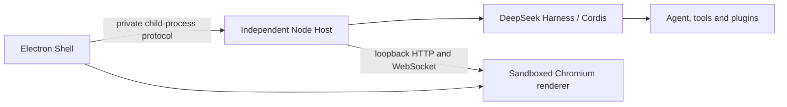

# DeepSeek Harness Station

[简体中文](README.zh-CN.md)

DeepSeek Harness Station is an experimental desktop workstation for DeepSeek Harness. It combines a narrow Electron shell with an independently supervised Node.js Host. The Host owns the Cordis tree, Agent runtime, sessions, tools, terminals, profiles, and third-party plugins; the Electron process owns only native application lifecycle and presentation.

This repository is a clean-room implementation. It uses the published DeepSeek Harness APIs and documentation and does not contain source copied from other desktop wrappers.

## Architecture



The Shell generates a new generation id and capability for every Host launch. The Host publishes readiness only after the complete Harness Web profile activates and the operating system assigns its loopback port. The Shell rejects stale generations and non-loopback origins. A graceful stop disposes the Cordis root before the supervisor escalates to process termination.

## Development

Requirements: Node.js `^22.19.0 || >=24.0.0`, Corepack, and pnpm 11.7.0.

```sh
corepack pnpm install
corepack pnpm check
corepack pnpm dev
```

The default Host loads the standard `web` profile from the published `@deepseek-ai/dsh` installation. Harness credentials and user configuration retain their normal `$DSH_HOME` behavior.

## Windows installer

On Windows x64, run:

```sh
corepack pnpm dist:win
```

The pipeline performs type checking, tests, compilation, icon and third-party notice generation, ASAR/physical Host closure checks, packaged launch and single-instance smoke tests, NSIS creation, and PE verification. The installer is written to `dist/DeepSeek-Harness-Station-<version>-x64-Setup.exe`.

The desktop build now includes a generation-isolated Node Host, the standard `web` profile, a sandboxed loopback renderer, single-instance refocus, tray controls for open/restart/quit, bounded startup, process-tree cleanup, bounded crash recovery, and a per-user NSIS installer/uninstaller with a selectable destination.

Credentials, Harness profiles, and plugins retain their `$DSH_HOME` behavior. Temporary Host roots live under `$DSH_HOME/profiles/web/.station-generations`, preserving profile plugin resolution while keeping each generation isolated, and are removed after shutdown. Uninstall preserves user data by default.

## macOS packages

On macOS, run:

```sh
corepack pnpm dist:mac
```

The macOS pipeline builds and structurally verifies DMG and ZIP artifacts for the current architecture. GitHub Actions runs it natively on Intel (`x64`) and Apple Silicon (`arm64`) runners. Validation covers the Mach-O architecture, ASAR contents, complete Harness Host dependency closure, and architecture-specific `node-pty` and `koffi` native modules.

## GitHub Actions

Every push to `main`, and every manual workflow dispatch, runs `.github/workflows/build-desktop.yml`. The Windows job uploads the verified x64 NSIS installer; the macOS job uploads x64 and arm64 DMG and ZIP packages. Build artifacts are retained in GitHub Actions for 14 days.

## Project status

This is pre-release software. The current packages are not signed or notarized: Windows may show an unknown-publisher warning and macOS may require an explicit Open action. Configure Authenticode and Apple Developer ID signing/notarization before public distribution. Automatic updates require a release feed and are not enabled.

DeepSeek Harness Station is an independent community project built on DeepSeek Harness. It is not affiliated with or endorsed by DeepSeek.
