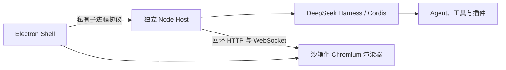

# DeepSeek Harness Station

[English](README.md)

DeepSeek Harness Station 是面向 DeepSeek Harness 的实验性桌面工作站。它由一个精简的 Electron Shell 和一个独立受监管的 Node.js Host 组成：Host 负责 Cordis 树、Agent 运行时、会话、工具、终端、配置档案及第三方插件；Electron 进程只负责原生应用生命周期和界面呈现。

本仓库采用洁净室方式实现，仅使用已发布的 DeepSeek Harness API 和文档，不包含从其他桌面封装项目复制的源代码。

## 架构



每次启动 Host 时，Shell 都会生成新的 generation id 与 capability。只有在完整的 Harness Web 配置档案激活、且操作系统已分配回环端口后，Host 才会发布就绪状态。Shell 会拒绝过期 generation 及非回环地址来源。正常停止时，会先释放 Cordis 根实例；随后监管器才会逐步升级到终止进程。

## 开发

环境要求：Node.js `^22.19.0 || >=24.0.0`、Corepack 和 pnpm 11.7.0。

```sh
corepack pnpm install
corepack pnpm check
corepack pnpm dev
```

默认 Host 会加载已发布 `@deepseek-ai/dsh` 包中的标准 `web` 配置档案。Station 会将 OpenAI 兼容服务 `http://172.16.144.161:8000/v1` 中的 `Qwen3.8-27B-FP8` 注册为新会话的默认模型，默认不鉴权。由于底层 OpenAI 客户端要求凭据字段存在，无鉴权模式会发送一个固定、非秘密的兼容占位 Authorization；服务端无需验证它。可通过继承环境、项目 `.env` 或 `$DSH_HOME/.env` 中的 `LLM_MODEL_NAME`、`LLM_BASE_URL` 和可选的非空 `LLM_API_KEY` 覆盖这些启动默认值。Harness 的模型设置、凭据和用户 patch 层继续沿用原有的 `$DSH_HOME` 行为，并且优先级高于 Station 默认值。

## Windows 安装包

在 Windows x64 上执行：

```sh
corepack pnpm dist:win
```

流水线会依次完成类型检查、测试、构建、图标与第三方许可证声明生成、ASAR/物理 Host 闭包检查、成品启动与单实例冒烟、NSIS 安装器生成和 PE 校验。安装器输出到 `dist/DeepSeek-Harness-Station-<version>-x64-Setup.exe`。

当前桌面版本包含：独立且按 generation 隔离的 Node Host、标准 `web` 配置档案、沙箱化回环 Renderer、单实例重新聚焦、系统托盘与应用菜单中的打开/重启 Host/检查更新/退出、启动和每 6 小时自动检查新版、经过 SHA-256 校验的应用内下载安装、启动超时、进程树清理、有限次数的崩溃自动恢复，以及可选择安装目录的按用户 NSIS 安装/卸载。同源的 Harness 页面始终留在桌面 App 内，不会再把随机回环端口额外打开到系统浏览器。

用户凭据、Harness 配置档案和插件继续保存在 `$DSH_HOME`；临时 Host 根配置位于 `$DSH_HOME/profiles/web/.station-generations`，这样既保持每代隔离，也保留 Harness 的 profile 插件解析链，退出后会自动清理。卸载默认保留用户数据。

Station 内置 Harness `0.1.2-rc.1`。更新提示点击“立即下载”后由 App 下载并校验安装包；GitHub API 检查失败时会尝试 Release Atom 订阅源。旧用户通知条件和发布步骤见 [升级说明](docs/release-0.26.9-beta.2.zh-CN.md)。

Windows 安装器直接解压到目标目录，安装后创建桌面图标及开始菜单中的应用和卸载入口。“应用”菜单还提供“创建桌面快捷方式”和“卸载应用…”。卸载保留会话、配置和工作区文件。安装、重装与卸载测试从同一成品构建独立应用标识和程序名的测试安装器，不使用正式版的注册信息或快捷方式；耗时记录在 `dist/installer-timings.json`。

## macOS 安装包

在 macOS 上执行：

```sh
corepack pnpm dist:mac
```

macOS 流水线会为当前架构生成并校验 DMG、ZIP；GitHub Actions 分别使用原生 Intel（`x64`）和 Apple Silicon（`arm64`）runner 执行。校验内容包括 Mach-O 架构、ASAR 内容、完整 Harness Host 依赖闭包，以及对应架构的 `node-pty`、`koffi` 原生模块。

## GitHub Actions

每次推送到 `main`、版本标签，或手动运行 workflow 时，`.github/workflows/build-desktop.yml` 都会启动。Windows job 上传经过验证的 x64 NSIS 安装器；版本标签还会发布包含安装包与 `SHA256SUMS.txt` 的 GitHub Release，供客户端检测并升级。macOS job 上传 x64、arm64 两套 DMG 和 ZIP。构建产物在 GitHub Actions 中保留 14 天。

GitLab 会在默认分支、标签和手动启动流水线时运行 `.gitlab-ci.yml` 的 Windows 构建。原生 Shell Runner 需要预装 Node.js 24 与 Corepack，并带有 `windows` + `x64` 标签。通过校验的 EXE 和 SHA-256 文件上传至 Package Registry，版本标签会自动创建带直接下载入口的 Release；校验文件、下载说明和安装耗时作为小型流水线附件保留 14 天。

## 项目状态

这是预发布软件。当前安装包尚未签名或公证：Windows 可能显示“未知发布者”，macOS 可能需要通过右键“打开”确认运行。正式外部分发前应配置 Authenticode、Apple Developer ID 签名与 notarization。应用从已发布且包含完整 Windows 安装包的 GitHub Release 检测版本；用户确认后才会下载、校验并启动安装程序，不会静默覆盖。

DeepSeek Harness Station 是基于 DeepSeek Harness 构建的独立社区项目，与 DeepSeek 没有隶属或背书关系。
