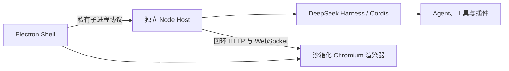

# DeepSeek Harness Station

[English](README.md)

DeepSeek Harness Station 是面向 DeepSeek Harness 的实验性桌面工作站。它由一个精简的 Electron Shell 和一个独立受监管的 Node.js Host 组成：Host 负责 Cordis 树、Agent 运行时、会话、工具、终端、配置档案及第三方插件；Electron 进程只负责原生应用生命周期和界面呈现。

本仓库采用洁净室方式实现，仅使用已发布的 DeepSeek Harness API 和文档，不包含从其他桌面封装项目复制的源代码。

## 架构



每次启动 Host 时，Shell 都会生成新的 generation id 与 capability。只有在完整的 Harness Web 配置档案激活、且操作系统已分配回环端口后，Host 才会发布就绪状态。Shell 会拒绝过期 generation 及非回环地址来源。正常停止时，会先释放 Cordis 根实例；随后监管器才会逐步升级到终止进程。

## 开发

环境要求：Node.js `^22.19.0 || >=24.0.0`、Corepack 和 pnpm 11.7.0。

```sh
corepack pnpm install
corepack pnpm check
corepack pnpm dev
```

默认 Host 会加载已发布 `@deepseek-ai/dsh` 包中的标准 `web` 配置档案。Harness 凭据和用户配置继续沿用原有的 `$DSH_HOME` 行为。

## 当前范围

第一个里程碑包含：进程拆分、Web 配置档案启动、受保护的导航、单实例行为、有界启动，以及 Host 的正常释放。打包、配置档案选择界面、更新器集成、托盘控制、崩溃循环恢复和带认证的浏览器引导仍属于后续里程碑。

## 项目状态

这是预发布软件。在首个带标签的版本发布前，生命周期协议可能会发生变化。

DeepSeek Harness Station 是基于 DeepSeek Harness 构建的独立社区项目，与 DeepSeek 没有隶属或背书关系。
